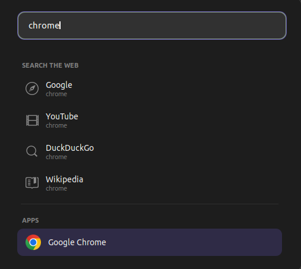

# Launcher Search — GNOME Shell Extension

A Spotlight-style search for the GNOME top panel. Search apps, the web, files,
folders, do math, and run commands — all from one box in your panel.

## Features

- App search & launch with real icons
- Web search: Google, YouTube, DuckDuckGo, Wikipedia
- Calculator — type `12 * 8` and copy the answer
- File search — `f: report` finds files
- Folder search — `d: projects` finds folders
- Open URLs — type `github.com` to go there
- Run commands — type `> firefox`
- Smart ranking and fast hybrid file search

## Requirements

GNOME Shell 42. For fast file search:

    sudo apt install plocate
    sudo updatedb

## Install

    git clone https://github.com/rahulkrithwan27-sys/launcher-search.git ~/.local/share/gnome-shell/extensions/launcher-search@whoami

Reload GNOME Shell (Alt+F2, type r, Enter on X11), then:

    gnome-extensions enable launcher-search@whoami

## Usage

| Type | What it does |
|------|--------------|
| firefox | launch the app |
| 12 * 8 | calculator |
| f: report | find files |
| d: projects | find folders |
| github.com | open website |
| > gnome-terminal | run a command |

## License

MIT
